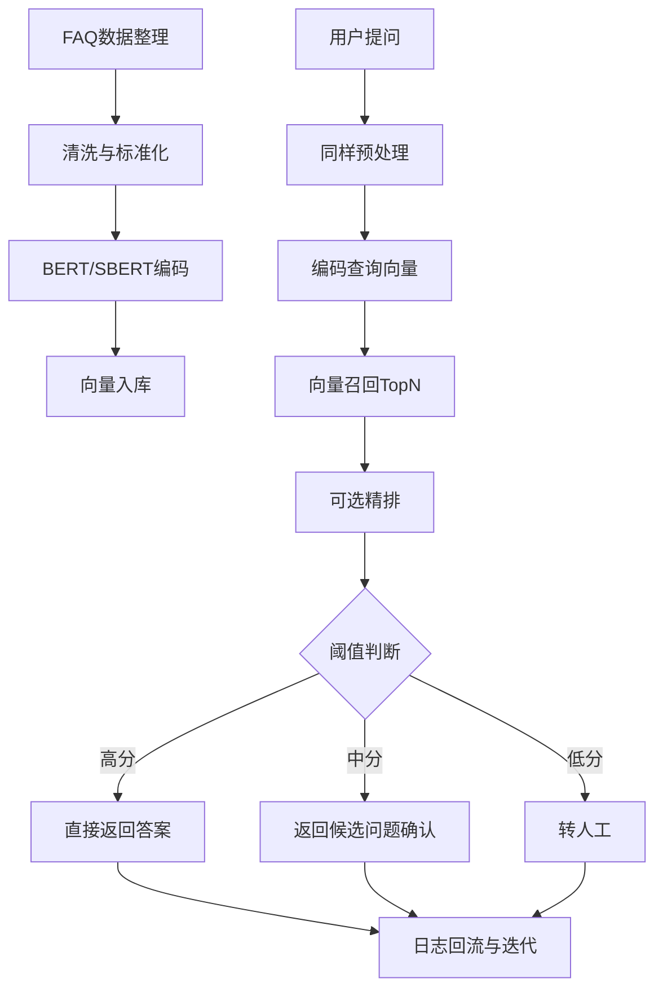

# 第五周作业2：使用 BERT 做文本编码与相似度计算

我对这题的技术方案理解是：把系统分成离线和在线两部分。

1.离线部分先处理 FAQ 数据：把标准问、相似问、类目、答案整理干净，做去重和文本规范化。然后用 BERT/SBERT 把每条问句编码成向量，存到向量库里（比如 FAISS 或 Milvus），并记录模型版本，方便后续更新。

2.在线部分是用户提问进来之后的流程：先做同样的预处理，再用同一个 BERT 模型编码为查询向量；在向量库里检索 TopN 候选；如果有条件，可以再加一层精排模型提高准确率。最后根据相似度阈值决策：分数高就直接回复答案，分数中等给候选问题让用户确认，分数低就转人工。

3.相似度计算可以用余弦相似度：`sim(q,d)=q·d/(||q|| ||d||)`。为了让效果越来越好，还要把用户点击、是否解决、是否转人工这些日志回流，用来做后续微调和评估（比如 Recall@K、人工接管率）。

这个方案的优点是实现难度适中、响应快、可维护，也比较符合 FAQ 场景“稳定第一”的要求。

